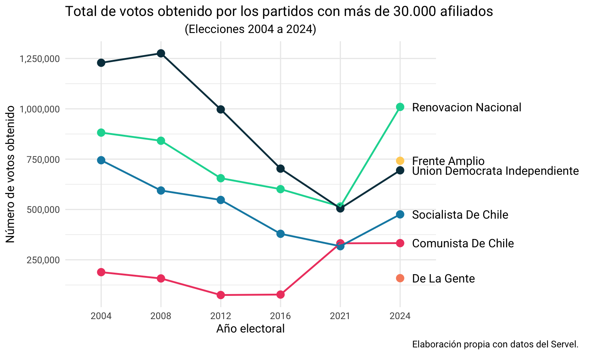

<!-- README.md is generated from README.Rmd. Please edit that file -->

```{r, include = FALSE}
knitr::opts_chunk$set(
  collapse = TRUE,
  comment = "#>",
  fig.path = "man/figures/README-",
  out.width = "100%"
)
```

# votosCL 

<!-- badges: start -->

<!-- badges: end -->

Descripción:

¿Qué es lo nuevo?

- Sexo en las últimas elecciones.
- Estandarización de los nombres.
- Recopilación de todas la información desde las elecciones en 1989.

## Instalación

El paquete votosCL puedes instalarlo a través de GitHub:

``` r
# install.packages("devtools")
devtools::install_github("snaraya/votosCL")
```

## Datos

El paquete se compone de múltiples bases de datos que contienen los resultados electorales del Servicio Electoral de Chile (SERVEL). Las bases de datos se componen por:

### Bases de datos completas "en bruto"

Descripción tabla

### Base de datos resultados por candidato

Descripción tabla

### Base de datos histórico por tipo de elección

Descripción tabla

## Ejemplos

A continuación se muestran algunos ejemplos de exploración de estos datos:

Resultados electorales por género:

```{r example}
library(votosCL)

# Limpieza de datos hasta gráfico de barras stacked
```

**Resultados electorales por partido**

De acuerdo al [Centro de Datos del SERVEL](https://www.servel.cl/centro-de-datos/estadisticas-de-datos-abiertos-4zg/estadisticas-de-partidos-politicos/total-de-afiliados-a-partidos-politicos/), los partidos políticos con más de 30.000 militantes son el Frente Amplio, Partido Nacional Libertario, Comunista de Chile, Partido de la Gente, Socialista de Chile, Renovación Nacional y Unión Demócrata Independiente. Con esta información, nosotros podemos ver la evolución de cada uno de esos partidos en las elecciones municipales. Pero ojo, mucho de esos **partidos son nuevos o relativamente nuevos**.

``` r

# Primero, seleccionamos los partidos de interés:
partidos <- c(
  "frente amplio",
  "nacional libertario",
  "comunista de chile",
  "de la gente",
  "socialista de chile",
  "renovacion nacional",
  "union democrata independiente"
)

# Agrupamos por año y partido para calcular el total de votos obtenidos
votos_partido <- elecciones_alcalde |> 
  filter(partido %in% partidos) |> 
  group_by(anio, partido) |> 
  summarise(votos_partido = sum(votos)) 

# Este paso nos permitirá tener el nombre del partido al final de la línea del gráfico
etiquetas_24 <- votos_partido |> 
  filter(anio == 2024) |> 
  mutate(partido = str_to_title(partido))

# Graficamos
ggplot(data = votos_partido,
       aes(
         x = factor(anio),
         y = votos_partido,
         color = partido,
         group = partido
       )) +
  geom_point(size = 3) +
  geom_line(linewidth = 0.8) +
  geom_text(
    data = etiquetas_24,
    aes(label = partido),
    hjust = 0,
    nudge_x = 0.2,
    show.legend = FALSE,
    color = "black",
    family = "Roboto"
  ) +
  scale_y_continuous(labels = scales::comma) +
  scale_color_manual(values = c(
    "#ef476f",
    "#f78c6b",
    "#ffd166",
    "#06d6a0",
    "#118ab2",
    "#073b4c"
  )) +
  labs(
    y = "Número de votos obtenido",
    x = "Año electoral",
    title = "Total de votos obtenido por los partidos con más de 30.000 afiliados",
    subtitle = "(Elecciones 2004 a 2024)",
    caption = "Elaboración propia con datos del Servel."
  ) +
  theme_minimal(base_family = "Roboto") +
  theme(
    legend.position = "none",
    plot.subtitle = element_text(hjust = 0.5),
    plot.title.position = "panel",
    plot.margin = margin(5.5, 150, 5.5, 5.5),
    plot.caption = element_text(hjust = 1.7)
  ) +
  coord_cartesian(clip = "off")
```


Aun así, hay que tener en consideración algunos factores, ya que las elecciones se han realizado bajo diferentes modalidades. Para las elecciones del 2004 y 2008, la inscripción era voluntaria y el voto obligatorio. En las elecciones entre el 2012 y 2021 la inscripción fue automática y voto voluntario. En las últimas elecciones empezó a correr la inscripción automática y voto obligatorio, por lo que los totales subieron en comparación con la elección anterior.

¿Qué pasa si consideramos a los independientes?

## Fuente de los datos

Los datos fueron obtenidos a través de la página del Servicio Electoral de Chile.

## Paquetes similares:

- Paquetes de otros países.
